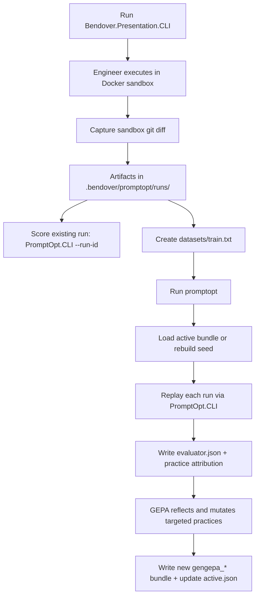

# Bendover 

Bendover is an opinionated, self improving coding agent.

It’s an experiment in building an agentic system that can learn and apply a specific coding policy aka judgment when ambiguity shows up, instead of falling back to generic pre training led reasoning that doesn’t align.

_The name bendover is inspired by a soca song that goes a little something like this 🎵[...] take it easy I will do the work, you don't have to [...]🎵_

# The Hypothesis

Teaching an LLM to consistently squeeze out ambiguity will improve output quality more than adding more instructions or examples.

# The Experiment

To build a non-trivial bootstrapped agentic coding system that learns from feedback to build itself. 

- Leverage an LLM to write > 95% of the code
- Start with an existing agentic loop (i.e. Claude, Antigravity, Codex, etc.) 
- Capture real coding runs and score outputs
- Replay those runs to learn a policy<sup>*</sup> when tasks are ambiguous

Some notes:
- Behavior is defined by role targeted practices → "this is how I do X"
- Judgment over syntax → identical decisions, not code
- Real work is the dataset → learning comes from specific examples, not volume
- The initial Bendover scaffolding is intentionally opinionated → my own judgement

<sup>*</sup> The policy it learns must match the one I use internally when ambiguity shows up. That policy is expressed through code. 

From here on, everything in this repo has been written by an agent. 

## Prerequisites

- **.NET 10.0 SDK**
- **Docker Desktop** (Windows/macOS) or **Docker Engine** (Linux/WSL)
- **Python 3.10+**

## Quickstart (First Successful Loop)

This is the shortest end-to-end path from real run capture to GEPA optimization.
If you're on macOS/Windows, skip the Linux/WSL-only setup step and rely on the prerequisites above.

```bash
# 1) Ensure .env exists
cp .env.example .env

# 2) Linux/WSL only: bootstrap dependencies and wrapper
./setup.sh

# 3) Build and test
dotnet build
dotnet test

# 4) Capture a real run
# The CLI prints: run_id=<value>
./bendover "Add a unit test for run scoring"

# 5) Score the captured run (use the printed run_id)
dotnet run --project src/Bendover.PromptOpt.CLI -- --run-id <run_id> --verbose

# 6) Create GEPA training split
mkdir -p .bendover/promptopt/datasets
printf "%s\n" "<run_id>" > .bendover/promptopt/datasets/train.txt

# 7) Install promptopt in editable mode
python -m venv .venv
./.venv/bin/pip install -e .

# 8) Run GEPA 
./.venv/bin/promptopt --promptopt-root .bendover/promptopt --max-full-evals 3

# 9) Inspect active optimized bundle
cat .bendover/promptopt/active.json
```

## Configuration (.env Only)

Both CLI entry points load `.env` by traversing upward from the current directory (`Env.TraversePath().Load()`), then bind settings from environment variables.

### Agent runtime configuration

```dotenv
Agent__Model=openai/gpt-oss-20b
Agent__Endpoint=http://127.0.0.1:1234/v1
Agent__ApiKey=sk-local-dummy
```

### Prompt optimization configuration

```dotenv
# PromptOpt replay command used by the Python optimizer
export PROMPTOPT_CLI_COMMAND='dotnet run --project src/Bendover.PromptOpt.CLI --'

# Reflection model provider settings (OpenAI API key mode)
OPENAI_API_BASE=https://api.openai.com/v1
OPENAI_API_KEY=sk-your-openai-key
DSPY_REFLECTION_MODEL=openai/gpt-4o
```

### ChatGPT Plus/Pro Subscription (No API key)

Connect once:

```bash
./bendover /connect
```

Disconnect when needed:

```bash
./bendover /disconnect
```

Manual fallback: delete `~/.bendover/chatgpt.json`.

Model behavior with subscription:

- If `Agent__ApiKey` is empty and a ChatGPT session exists, the CLI uses subscription mode.
- Default model is `gpt-5.3-codex`.
- You can override with `Agent__Model`.

Reflection model note:

- DSPy reflection uses Python-side provider settings (`OPENAI_*`, `DSPY_REFLECTION_MODEL`).
- To use ChatGPT subscription for reflection, run the local proxy and point `OPENAI_API_BASE` to it:

```bash
dotnet run --project src/Bendover.PromptOpt.CLI -- serve-chatgpt-proxy
```

```dotenv
OPENAI_API_BASE=http://127.0.0.1:11434/v1
OPENAI_API_KEY=sk-local-dummy
DSPY_REFLECTION_MODEL=gpt-5.3-codex
```

## Core Concepts (Plain English)

- **Run**: One recorded agent session under `.bendover/promptopt/runs/<run_id>`.
- **Evaluation**: Rule checks applied to run artifacts (`git_diff.patch`, test output, selected practices).
- **Score**: Numeric quality result written to `evaluator.json` (`0.0` to `1.0`).
- **Practice attribution**: Practice-specific evaluator feedback in `practice_attribution.notes_by_practice`.
- **Bundle**: Versioned prompt package (practices + agents) under `.bendover/promptopt/bundles/<bundle_id>`.
- **Active bundle**: Bundle ID in `.bendover/promptopt/active.json` used as current optimization baseline.
- **GEPA**: DSPy optimizer that replays runs, reads evaluator feedback, and mutates targeted practices.

## Workflow Diagram



## 1. Capture Runs

Capture a run:

```bash
./bendover "Your task description"
```

The CLI prints:

- `run_id=<run_id>`
- `artifacts=.bendover/promptopt/runs/<run_id>`

### Sandbox and Patch Apply Behavior

- Engineer code is executed inside a Docker sandbox container.
- The system captures `git_diff.patch` from the sandbox workspace into run artifacts.
- In `Bendover.Presentation.CLI` runs, that sandbox patch is applied back to your source repository.
- In PromptOpt replay/evaluation runs, patch application to your source repo is disabled; replay runs in a temporary clone and only emits artifacts/output.

### Key Artifacts

When capture is enabled, `prompts.json`, `outputs.json`, and `transcript.md` are updated during execution at lead output and engineer step-boundary events (observation/failure), then finalized again at run completion.

| Artifact | Produced by | Purpose | Consumed by |
| --- | --- | --- | --- |
| `goal.txt` | run recorder | original user goal | GEPA replay context |
| `base_commit.txt` | run recorder | commit used for reproducible replay | PromptOpt replay + GEPA |
| `bundle_id.txt` | run recorder | bundle identifier used during run | scoring bundle resolution |
| `run_meta.json` | run recorder | metadata (`run_id`, timestamps, bundle) | scoring fallback resolution |
| `prompts.json` | run recorder | phase prompt transcripts | debugging/manual inspection |
| `outputs.json` | run recorder | phase outputs (incl. lead practice selection) | evaluator + verbose summaries |
| `git_diff.patch` | orchestrator sandbox artifact | code diff produced by run | evaluator + GEPA context |
| `dotnet_build.txt` / `dotnet_build_error.txt` | orchestrator sandbox artifact | build signal | GEPA context |
| `dotnet_test.txt` / `dotnet_test_error.txt` | orchestrator sandbox artifact | test signal | evaluator + GEPA context |
| `sdk_surface_context.md` | orchestrator sandbox artifact | SDK tool contract snapshot | debugging/manual inspection |
| `evaluator.json` | PromptOpt evaluator | pass/score/attribution output | GEPA scoring + manual inspection |

## 2. Score Existing Runs (No Replay)

Score a recorded run without rerunning agents:

```bash
dotnet run --project src/Bendover.PromptOpt.CLI -- --run-id <run_id> --verbose
```

Bundle resolution in `--run-id` mode:

1. If `--bundle <path>` is provided, that path is used.
2. Otherwise `bundle_id.txt` in the run directory is used.
3. If missing, fallback is `run_meta.json` (`bundle_id` or `bundleId`).
4. `current` or legacy `default` resolve to root `.bendover`.
5. Scoring writes/overwrites `evaluator.json` in the run directory.

## 3. Replay + Evaluate a Bundle

Replay mode executes the run from a specific commit with a specific bundle:

```bash
dotnet run --project src/Bendover.PromptOpt.CLI -- \
  --bundle .bendover/promptopt/bundles/<bundle_id> \
  --task /path/to/task-dir \
  --out /path/to/output-dir \
  --verbose
```

Task directory contract:

- `task.md`: goal text
- `base_commit.txt`: commit hash to checkout before replay

Output directory contains replay artifacts plus `evaluator.json`.

## 4. GEPA Optimization

### 4.1 Prepare dataset split

Create `.bendover/promptopt/datasets/train.txt` with one run ID per line:

```text
20260211_220801_08c49959
20260211_223728_090bd5bf
```

### 4.2 Install promptopt

```bash
python -m venv .venv
./.venv/bin/pip install -e .
```

### 4.3 Run GEPA

```bash
./.venv/bin/promptopt --promptopt-root .bendover/promptopt --max-full-evals 3
```

If `PROMPTOPT_CLI_COMMAND` is not set in environment or `.env`, pass `--cli-command` explicitly.

Useful option:

- `--disable-dspy-cache` disables DSPy disk/memory cache.

Bundle lifecycle (current behavior):

1. If `.bendover/promptopt/active.json` exists, GEPA starts from that bundle.
2. If missing, GEPA rebuilds `.bendover/promptopt/bundles/seed` from root `.bendover/practices` and `.bendover/agents`, then writes `active.json` to `seed`.
3. New bundles are written as `gengepa_<hash8>` under `.bendover/promptopt/bundles`.
4. `active.json` is updated to the best generated bundle with score metadata.

Preflight requirement:

- GEPA requires `practice_attribution.notes_by_practice` feedback for the first training batch.
- If no practice-targeted notes exist, GEPA exits early with an attribution preflight error.

## 5. How Evaluation Works

PromptOpt CLI auto-discovers all `IEvaluatorRule` implementations from the assembly.

Rule execution model:

1. `selected_practices` come from Lead output in `outputs.json`.
2. `all_practices` come from `<bundle>/practices/*.md` (frontmatter `Name`, fallback filename).
3. If a rule convention-matches any practice, it is practice-bound and runs only when that practice is selected.
4. If a rule matches no practice, it is global and always runs.

Convention matching:

- Practice: `practice_name`
- Rule class: `PracticeNameRule`
- Matching ignores case and separators (`_`, `-`).

Evaluator contract (`evaluator.json`):

```json
{
  "pass": true,
  "score": 0.92,
  "flags": [],
  "notes": [],
  "practice_attribution": {
    "selected_practices": ["tdd_spirit"],
    "offending_practices": [],
    "notes_by_practice": {
      "tdd_spirit": ["example feedback"]
    }
  }
}
```

## 6. Troubleshooting

### 6.1 Missing model/endpoint/api key

- Verify `.env` includes `Agent__Model`, `Agent__Endpoint`, `Agent__ApiKey` for endpoint mode.
- For subscription mode, run `/connect` and leave `Agent__ApiKey` empty.
- For reflection via subscription, start `serve-chatgpt-proxy` and set `OPENAI_API_BASE=http://127.0.0.1:11434/v1`.

### 6.2 Docker unavailable

- Start Docker Desktop/Engine.
- Verify:

```bash
docker run --rm hello-world
```

### 6.3 Missing run artifacts

- `--run-id` scoring requires `.bendover/promptopt/runs/<run_id>`.
- Replay mode requires `task.md` and `base_commit.txt`.

### 6.4 GEPA attribution preflight failed

This means evaluator output did not include practice-targeted notes in `practice_attribution.notes_by_practice` for the first batch. Common causes:

- only global rules fired,
- practice-specific rules did not match selected practices,
- rules passed without producing practice-specific notes.

### 6.5 Bundle path errors during scoring

If scoring says the resolved bundle path is missing:

- pass `--bundle <path>` explicitly, or
- check `bundle_id.txt` / `run_meta.json` in the run directory, and
- verify the resolved bundle contains a `practices/` directory.
